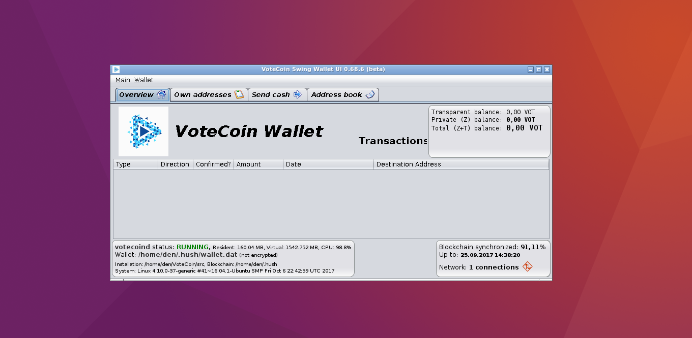

# [VoteCoin](https://www.votecoin.site/) Desktop GUI Wallet

## Graphical user interface wrapper for the [VoteCoin](https://www.votecoin.site/) command line tools

This program provides a Graphical User Interface (GUI) for the VoteCoin client tools that acts as a wrapper and presents the information in a user-friendly manner.



#### New/Experimental: [VoteCoin Desktop GUI Wallet for Windows](https://github.com/vaklinov/votecoin-swing-wallet-ui/blob/master/docs/Release_0.68.6.md) is available


## Building, installing and running the Wallet GUI

Before installing the Desktop GUI Wallet you need to have VoteCoin up and running. The following [guide](https://github.com/MyHush/hush/blob/master/README.md) explains how to set up [VoteCoin](https://www.votecoin.site/). 

**For security reasons it is recommended to always build the GUI wallet program from GitHub**
**[source](https://github.com/vaklinov/votecoin-swing-wallet-ui/archive/master.zip).**
The details of how to build it are described below (easy to follow). 

1. Operating system and tools

   As of May 2017 (VoteCoin v1.0.9) this program is mostly tested on Linux. The Linux tools you need 
   to build and run the Wallet GUI are Git, Java (JDK7 or later) and Ant. If using Ubuntu Linux, 
   they may be installed via command: 
   ```
   user@ubuntu:~/build-dir$ sudo apt-get install git default-jdk ant
   ``` 
   For RedHat/CentOS/Fedora-type Linux systems the command is (like):
   ```
   user@centos:~/build-dir$ sudo yum install java-1.8.0-openjdk git ant 
   ```
   The name of the JDK package (`java-1.8.0-openjdk`) may vary depending on the Linux system, so you need to
   check it, if name `java-1.8.0-openjdk` is not accepted.
   If you have some other Linux distribution, please check your relevant documentation on installing Git, 
   JDK and Ant. The commands `git`, `java`, `javac` and `ant` need to be startable from command line 
   before proceeding with build.

2. Building from source code

   As a start you need to clone the votecoin-swing-wallet-ui Git repository:
   ```
   user@ubuntu:~/build-dir$ git clone https://github.com/vaklinov/votecoin-swing-wallet-ui.git
   ```
   Change the current directory:
   ```
   user@ubuntu:~/build-dir$ cd votecoin-swing-wallet-ui/
   ```
   Issue the build command:
   ```
   user@ubuntu:~/build-dir/votecoin-swing-wallet-ui$ ant -buildfile ./src/build/build.xml
   ```
   This takes a few seconds and when it finishes, it builds a JAR file `./build/jars/VoteCoinSwingWalletUI.jar`. 
   You need to make this file executable:
   ```
   user@ubuntu:~/build-dir/votecoin-swing-wallet-ui$ chmod u+x ./build/jars/VoteCoinSwingWalletUI.jar
   ```
   At this point the build process is finished the built GUI wallet program is the JAR 
   file `./build/jars/VoteCoinSwingWalletUI.jar`

3. Installing the built VoteCoin GUI wallet

  3.1. If you have built VoteCoin from source code:

   Assuming you have already built it from source code in directory `/home/user/votecoin/src` (for 
   example - this is the typical build dir. for VoteCoin v1.0.8) which contains the command line tools `votecoin-cli` 
   and `votecoind` you need to take the created file `./build/jars/VoteCoinSwingWalletUI.jar` and copy it 
   to directory `/home/user/hush/src` (the same dir. that contains `votecoin-cli` and `votecoind`). Example copy command:
   ```
   user@ubuntu:~/build-dir/votecoin-swing-wallet-ui$ cp ./build/jars/VoteCoinSwingWalletUI.jar /home/user/hush/src    
   ```

4. Running the installed VoteCoin GUI wallet

   Before running the GUI you need to start votecoind (e.g. `votecoind --daemon`). The wallet GUI is a Java program packaged 
   as an executable JAR file. It may be run from command line or started from another GUI tool (e.g. file manager). 
   Assuming you have already installed VoteCoin and the GUI Wallet `VoteCoinSwingWalletUI.jar` in 
   directory `/home/user/hush/src` one way to run it from command line is:
   ```
   user@ubuntu:~/build-dir/votecoin-swing-wallet-ui$ java -jar /home/user/hush/src/VoteCoinSwingWalletUI.jar
   ```
   If you are using Ubuntu (or similar ;) Linux you may instead just use the file manager and 
   right-click on the `VoteCoinSwingWalletUI.jar` file and choose the option "Open with OpenJDK 8 Runtime". 
   This will start the VoteCoin GUI wallet.
   
   **Important:** the VoteCoin configuration file `~/.votecoin/votecoin.conf` needs to be correctly set up for the GUI
    wallet to work. Specifically the RPC user and password need to be set in it like:
    ```
    rpcuser=username
    rpcpassword=wjQOHVDQFLwztWp1Ehs098LKJHAXjd4E
    
    ``` 

### Donations accepted
At the present time this project is non-commercial in nature and developed by volunteers. If you find the GUI
Wallet useful, please consider making a donation for its further development. Your contribution matters! Donations 
are accepted at VoteCoin T address:
```
t1UDhNq2aEqvxEbPzcRM8n2QJV8YJ664rXJ
```

### License
This program is distributed under an [MIT License](https://github.com/vaklinov/votecoin-swing-wallet-ui/raw/master/LICENSE).

### Disclaimer

THE SOFTWARE IS PROVIDED "AS IS", WITHOUT WARRANTY OF ANY KIND, EXPRESS OR
IMPLIED, INCLUDING BUT NOT LIMITED TO THE WARRANTIES OF MERCHANTABILITY,
FITNESS FOR A PARTICULAR PURPOSE AND NONINFRINGEMENT. IN NO EVENT SHALL THE
AUTHORS OR COPYRIGHT HOLDERS BE LIABLE FOR ANY CLAIM, DAMAGES OR OTHER
LIABILITY, WHETHER IN AN ACTION OF CONTRACT, TORT OR OTHERWISE, ARISING FROM,
OUT OF OR IN CONNECTION WITH THE SOFTWARE OR THE USE OR OTHER DEALINGS IN THE
SOFTWARE.
